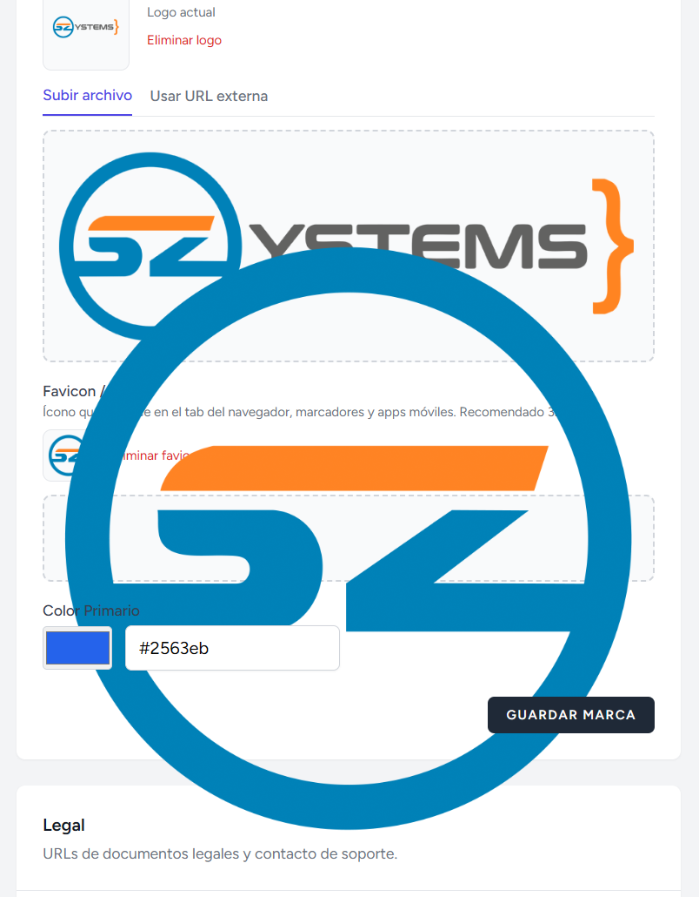

# 📝 Tareas Pendientes

> Actualizado: 2026-04-30
> Enfoque: SaaS-First

---

## ✅ Hardening Fase 7/8 (2026-04-30) — COMPLETADO

> Resultado de revisión de código de Fase 7 (Profile + Ownership Transfer) y Fase 8 (Reports). Aplicado en este sprint.

### Fase 7
- [x] A1 — `transferOwnership` atómico con `DB::transaction` + Activity Log explícito (`ownership_transferred` con properties detalladas) + manejo de excepciones.
- [x] B1 — `locale`/`timezone` con `<select>` y validación `Rule::in` (en lugar de inputs de texto libres).
- [x] B2 — Evento DOM `profile-updated` desde `updateProfile` para refrescar el nombre en la navbar sin recargar.
- [x] B3 — Cambio de email envía `sendEmailVerificationNotification()` al nuevo correo además de invalidar `email_verified_at`.

### Fase 8
- [x] A2 — Métodos de gráfica unificados con `baseQuery()` (consistencia multi-tenant + filtros aplicados a todas las series).
- [x] A3 — Labels de status/type traducidas; array `colors` emitido para JS.
- [x] B4 — Export CSV con cabecera (clínica, generado_at, periodo, filtros) + filas traducidas + resumen final.
- [x] C3 — Botón "Limpiar filtros" condicional + i18n (`reports.clear_filters`).

**Validación:** 268/268 tests · Pint clean · `npm run build` OK.

---

## � Plan Maestro v1.0 + Forward-Compat (PROPUESTO 2026-04-30)

> **Objetivo:** consolidar todo lo pendiente (sprints abiertos + competitive features) en una sola hoja de
> ruta priorizada, **previendo desde ya los cambios de schema necesarios para no romper datos en producción**
> cuando agreguemos features post-lanzamiento. Cada migración futura debe ser **aditiva (nullable)** y nunca
> destructiva sobre data viva.
>
> **Premisa de forward-compatibility:**
> 1. Agregar columnas/tablas anticipadamente con `nullable` y defaults seguros, aunque no se usen aún.
> 2. Reservar nombres de columnas/relaciones críticas con tipos correctos (FK polimórficas listas).
> 3. Toda relación que **podría ser muchos** en el futuro, dejarla como tabla pivote desde día uno (no en JSON).
> 4. UUIDs como PK donde haya exposición pública (URLs, APIs futuras).
> 5. Soft deletes en todas las entidades de negocio (paciente, cita, historial, factura, staff).
> 6. Activity log obligatorio en cualquier cambio de datos sensibles.

---

### 🔴 BLOQUE 0 — Crítico para v1.0 (BLOQUEANTE de lanzamiento)

> Sin esto NO se puede lanzar comercialmente. Aborda: completar features iniciadas, hardening de seguridad,
> compliance mínimo y groundwork de schema para no romper data luego.

#### 0.1 Cierre de sprints abiertos
- [x] **Fase 3C** — Permisos personalizados (UI Staff\Edit + `extraPermissions` array + `syncPermissions` + `PERMISSION_CATALOG` + 4 tests Feature) ✅ 2026-04-30
- [x] **Hardening producción** — Webhook Paddle (`PADDLE_WEBHOOK_SECRET`), scheduler cron (`appointments:send-reminders`), rate limiters (`sensitive/global/api/webhook`), Policies (Patient, Appointment, MedicalRecord), SoftDeletes en todos los modelos core ✅ 2026-04-30
- [x] **Fix crítico PDF/Livewire** — `TenantMiddleware` y `SetLocale` registrados como persistent middleware en `AppServiceProvider`; `Patients\Show::exportPdf` usa `$patient->clinic` como fallback. Todos los PDFs ahora funcionan en acciones Livewire. ✅ 2026-04-30
- [x] **Módulo Configuración General Admin (subset v1)** — Branding (nombre, logo, favicon, color), Legal (URLs, email soporte), Defaults (locale, timezone, moneda), Feature flags. Dynamic branding en todos los layouts. ✅ 2026-04-30

#### 0.2 Forward-Compat DB — Migraciones preventivas (ADITIVAS, nullable) ✅ 2026-04-30

> **Aplicadas en producción.** 7 migraciones aditivas, todas reversibles (validado con migrate:rollback + migrate). Cero impacto en data viva. Tests 307/307 verde.
>
> **Migraciones creadas:**
> 1. `2026_04_30_000001_forward_compat_clinics_table` — `parent_clinic_id`, `legal_entity_id`, `data_retention_years`
> 2. `2026_04_30_000002_forward_compat_users_table` — 2FA secret/recovery/confirmed_at, `signature_path`, `last_seen_at`, `preferences`, `terms_accepted_at`
> 3. `2026_04_30_000003_forward_compat_patients_table` — `internal_notes`, `portal_user_id`, `external_id`, `consent_signed_at`, `marketing_opt_in`
> 4. `2026_04_30_000004_forward_compat_appointments_table` — `branch_id`, `consultation_price/discount`, `is_billable`, `confirmation_token`, `confirmed_via`, `telemedicine_link/provider`, `pre_consultation_form_id`, `parent_appointment_id`, `created_via`
> 5. `2026_04_30_000005_forward_compat_medical_records_table` — `amendment_of_id`, `template_id`, `signed_at`, `signature_hash`, `ai_generated`, `ai_metadata`
> 6. `2026_04_30_000006_create_app_settings_table` — key-value global de plataforma
> 7. `2026_04_30_000007_create_tags_and_taggables_tables` — sistema polimorfo de etiquetas
>
> **Modelos actualizados** (fillable + casts): `User`, `Clinic`, `Patient`, `Appointment`, `MedicalRecord`.
> **2FA secret/recovery_codes** se castean como `encrypted` y están en `$hidden`.
>
> **Decisiones de FK:**
> - `parent_clinic_id`, `branch_id`, `parent_appointment_id`, `amendment_of_id`, `portal_user_id` → `nullOnDelete` (preservan data histórica)
> - `tags.clinic_id`, `taggables.tag_id` → `cascadeOnDelete` (pertenencia estricta)
>
> **Columnas reservadas sin FK todavía** (las tablas se crearán cuando llegue la feature):
> - `appointments.pre_consultation_form_id` (UUID)
> - `medical_records.template_id` (UUID)

#### 0.2 Forward-Compat DB — Migraciones preventivas (ADITIVAS, nullable)

> Detalle hist\u00f3rico del dise\u00f1o (consolidado arriba). Las migraciones ya est\u00e1n aplicadas y los modelos sincronizados.

#### 0.3 Compliance mínimo v1.0
- [ ] **2FA opcional** — habilitable por usuario (Laravel Fortify o paquete equivalente). Schema ya reservado en 0.2.
- [x] **Consentimiento Términos & Privacidad** al registrar — checkbox + timestamp guardado en `users.terms_accepted_at` (2026-05-01)
- [x] **Cookie banner** en portal público (GDPR mínimo) (2026-05-01)
- [ ] **Política de retención por defecto** documentada (ej. 5 años para historiales tras última cita)
- [ ] **Export ZIP de data por clínica** — owner descarga su data completa (CSV/JSON) — feature simple en v1

#### 0.4 Operación / DevOps mínimo
- [ ] Backup automático diario (mysqldump → S3/storage cifrado)
- [x] Health check endpoint (`/health`) para uptime monitoring (2026-05-01)
- [ ] Logs estructurados (JSON) para producción
- [ ] Sentry / Bugsnag / similar para errores en prod
- [x] Variables de entorno revisadas (`.env.production.example`) (2026-05-01)
- [ ] `php artisan optimize` en deploy
- [ ] Documentación de deployment (Docker / VPS / similar)

---

### 🟠 BLOQUE 1 — Sprint inmediato post-lanzamiento (v1.1)

> Las features que más diferencian un producto vendible en LATAM. Después del lanzamiento, primer mes.

- [ ] **Recordatorios SMS/WhatsApp** — Twilio + WhatsApp Business; usa `confirmation_token` ya reservado
- [ ] **Confirmación por link** sin login — usa `confirmation_token` y `confirmed_via`
- [ ] **Bloqueo de horarios / vacaciones del doctor** — nueva tabla `doctor_unavailabilities` (date_from, date_to, reason, all_day)
- [ ] **Plantillas SOAP por especialidad** — nueva tabla `record_templates`; usa `medical_records.template_id` ya reservado
- [ ] **Etiquetas en pacientes** — usa tablas `tags` + `taggables` ya creadas
- [ ] **Búsqueda global Cmd+K** — Livewire component + Laravel Scout (opcional con SQLite/MySQL fulltext)
- [ ] **Audit log UI** — listar `activity_log` por clínica/usuario con filtros (índices ya reservados)
- [ ] **Conflicto de horarios** — validación en backend al crear/reagendar cita
- [ ] **Vista calendario semanal multi-doctor** — extender FullCalendar con resourceTimeline
- [ ] **Módulo Facturación v1 (MVP)** — tablas `invoices`, `invoice_items`, `invoice_payments` (ya diseñadas en backlog); usa campos `consultation_price` ya reservados en `appointments`
- [ ] **Notas internas y comentarios en cita** — usa `patients.internal_notes` ya reservado + nueva tabla `appointment_comments`
- [ ] **Dashboard del doctor personalizado** — vista filtrada por `doctor_id = auth()->id()`

---

### 🟡 BLOQUE 2 — Mediano plazo (v1.2 – v1.4)

- [ ] **Múltiples sucursales** — usa `parent_clinic_id` y `appointments.branch_id` ya reservados; UI en Settings
- [ ] **Portal del paciente** — usa `patients.portal_user_id` ya reservado; rutas `/portal/{token}`
- [ ] **Formularios pre-consulta** — nueva tabla `pre_consultation_forms`; usa `appointments.pre_consultation_form_id` ya reservado
- [ ] **Telemedicina integrada** — usa `telemedicine_link` y `telemedicine_provider` ya reservados; Daily.co o Jitsi
- [ ] **Recetas electrónicas con QR** — extender `medical_records` (campo `qr_payload` puede agregarse o reutilizar `signature_hash`)
- [ ] **Firma digital del doctor** — UI de subida; usa `users.signature_path` ya reservado
- [ ] **Importación CSV pacientes** — usa `patients.external_id` ya reservado para evitar duplicados
- [ ] **Sync Google Calendar / Outlook** — OAuth tokens en `users.preferences` JSON o tabla nueva `user_oauth_tokens`
- [ ] **Reportes avanzados** — no-show rate, ticket promedio, hora pico (queries sobre data ya existente)
- [ ] **Reagendamiento self-service** — usa `confirmation_token` y `parent_appointment_id` ya reservados
- [ ] **Lista de espera** — nueva tabla `waitlist_entries`
- [ ] **Inventario de insumos / medicamentos** — nuevas tablas `inventory_items`, `inventory_movements`
- [ ] **Catálogo procedimientos con imágenes** — nueva tabla `procedures` + `procedure_images` (galería)
- [ ] **NPS post-cita** — nueva tabla `satisfaction_surveys`; trigger al completar cita

---

### 🟢 BLOQUE 3 — Largo plazo (v2.0+)

- [ ] **IA: transcripción + resumen SOAP** — usa `ai_generated` y `ai_metadata` ya reservados; integración Whisper + LLM
- [ ] **Mobile app / PWA con offline**
- [ ] **API pública REST + OAuth** — `laravel/passport` o `sanctum`
- [ ] **Webhooks salientes** — nueva tabla `webhook_subscriptions` + worker
- [ ] **SSO Google/Microsoft** — `socialite`
- [ ] **Pasarelas de pago online** (Stripe/MercadoPago) — extender módulo Facturación
- [ ] **Facturación electrónica oficial por país** — adaptadores (Alegra, Facturama, NubeFact, etc.)
- [ ] **Integración con aseguradoras**
- [ ] **HIPAA / LGPD / GDPR formal** — auditoría de seguridad, BAA/DPA
- [ ] **Wearables / equipos médicos**
- [ ] **Marketing email / referidos / cupones**

---

### 🛡️ Reglas para evitar romper data en producción

> Estas reglas son **obligatorias** para cualquier migración futura una vez la app esté en producción.

1. **Toda migración nueva debe ser aditiva.** Nunca `dropColumn` sobre data viva sin un proceso de deprecación de 2+ versiones.
2. **Nuevas columnas siempre `nullable`** o con default seguro. Backfill posterior con jobs idempotentes.
3. **Nunca renombrar columnas** en producción — agregar nueva, copiar data, deprecar la vieja.
4. **Foreign keys con `onDelete('cascade')` solo en relaciones de propiedad estricta** (clinic→patient OK; user→appointment NO).
5. **UUIDs como PK** en todo lo expuesto (URLs, APIs futuras, exports). User es bigint y se queda así porque ya está en producción interna.
6. **Soft deletes** en patient, appointment, medical_record, invoice, user (clinic ya tiene status). Nunca `forceDelete` desde UI sin auditoría.
7. **Backups antes de migrar**. Migración debe ser reversible (`down()` real, no vacío) durante el primer mes.
8. **Tests Feature obligatorios** que verifiquen que data antigua sigue accesible tras la migración.
9. **Cambios de enum / status** se hacen agregando valores nuevos, nunca quitando ni renombrando.
10. **Activity log** debe quedar antes de cualquier cambio destructivo de data.
11. **Multi-tenant guard** verificado en cada nueva relación (siempre incluir `clinic_id` o pasar por entidad que lo tenga).
12. **Migración con data > 100k registros**: usar comandos artisan que procesen en chunks con barra de progreso.

---

### 📊 Resumen ejecutivo

| Bloque | Versión | Foco | Impacto en data viva |
|--------|---------|------|----------------------|
| **0** | v1.0 (lanzamiento) | Cierre + hardening + groundwork DB | Migraciones aditivas preventivas |
| **1** | v1.1 (mes 1) | SMS/WhatsApp + Facturación + búsqueda + plantillas | Solo features que usan schema ya reservado |
| **2** | v1.2–v1.4 (3-6 meses) | Sucursales + portal + telemedicina + recetas QR | Solo features que usan schema ya reservado |
| **3** | v2.0+ (6-12 meses) | IA + mobile + API + FE oficial + compliance | Nuevas tablas; sin tocar las existentes |

**Resultado esperado:** después del lanzamiento, ninguna feature futura del backlog requiere migrar data
viva ni rompe datos sensibles. Las migraciones del Bloque 0 son la "vacuna" para los Bloques 1-3.

---


---
](image.png)
### � Plan v1.0 Preliminar (lanzamiento mínimo funcional)

> **Objetivo:** dejar la aplicación lista para lanzar comercialmente con clínicas reales.
>
> **3 bloques bloqueantes:**
> 1. Sprint Print/Export (CSV + PDF) ← EN CURSO
> 2. Fase 3C — Permisos personalizados
> 3. Hardening producción (Paddle webhook, cron, rate limiting global, policies)
>
> Todo lo demás (portal paciente, SMS, telemedicina, IA, mobile, API) es **roadmap v2+**.

---

### 🖨️ Sprint Print/Export — CSV + PDF en todos los módulos ✅ COMPLETADO (2026-05-01)

> **Resultado:** 290 tests / 642 asserts. CSV + PDF en Pacientes, Citas, Historiales (PDF) y Staff (PDF). Permisos `*.export` y `*.print` añadidos al seeder.

#### A — Pulir PDF de Reportes ✅ (commit 0cd5b3d)

#### B — Módulo Pacientes ✅ (commit 70664f4)
- [x] CSV con filtros aplicados y BOM UTF-8
- [x] PDF listado A4 landscape con logo y filtros visibles
- [x] PDF ficha individual con datos personales + alergias + condiciones
- [x] Permisos `patients.export` / `patients.print`
- [x] 8 tests Feature

#### C — Módulo Citas ✅ (commit c710f26)
- [x] CSV con filtros (search/status/doctor/date) + cabecera
- [x] PDF agenda landscape
- [x] PDF comprobante individual con voucher + queue number
- [x] Permisos `appointments.export` / `appointments.print`
- [x] 7 tests Feature

#### D — Módulo Historial Médico ✅ (commit 0d5ec40)
- [x] PDF consulta con SOAP, signos vitales, diagnósticos, prescripciones, firmas
- [x] Respeta confidencialidad (`records.view_confidential`)
- [x] Permiso `records.print` (owner + doctor)
- [x] 4 tests Feature
- [x] NO incluye CSV ni listado masivo (datos sensibles)

#### E — Módulo Staff ✅ (commit 7f4c32f)
- [x] PDF directorio A4 con badges de rol y estado
- [x] Permiso `users.print` (owner + admin)
- [x] 3 tests Feature

#### Cierre del Sprint ✅
- [x] Permisos en `RolesAndPermissionsSeeder`
- [x] i18n ES/EN
- [x] 290/290 tests · Pint clean · build OK

---

### Fase 3C — Permisos Personalizados (Pendiente)
> **Por qué al final:** depende de tener todos los módulos definidos para saber qué permisos personalizar.
> **Por qué primero:** consolidar documentación, seguridad, bugs latentes y DX para que las próximas fases tengan una base limpia, testeada y observable. Sin esto, cada feature nueva acumula deuda técnica.

#### Bloque A — Documentación y ADRs ✅
- [x] Actualizar `PROJECT.md` (versión, puerto 8088, DB real, precios reales)
- [x] Regenerar `MODELS.md` (agregar Plan, ClinicInvitation, campos faltantes)
- [x] Reorientar `ROADMAP.md` (eliminar fases ya completadas, redirigir a TASKS.md)
- [x] Limpiar `STATUS.md` (eliminar "Próximas Fases" obsoleta)
- [x] Añadir ADR-008 (Política de Acceso), ADR-009 (Notificaciones), ADR-010 (Plan Free cortesía)
- [x] Verificar/actualizar `CONVENTIONS.md` (BelongsToClinic, ActivityLog, Tests)
- [x] Insertar Sprint Estabilización en este archivo (TASKS.md)

#### Bloque B — Seguridad + Multi-tenant tests ✅
- [x] Rate limiting en rutas sensibles: `/login`, `/register`, `/forgot-password`, `/invitation/*`
- [x] `tests/Feature/MultiTenantIsolationTest.php` con 2 clínicas + cross-data leak verificación (10 tests)
- [x] **CRÍTICO**: fix cross-tenant leak en Patients/Show, Patients/Edit, Staff/Edit (abort_if defense-in-depth)
- [x] `BelongsToClinic` aplicado a Patient, Appointment, MedicalRecord (con guard `app()->bound`)
- [x] Auditar factories: `clinic_id` siempre real (verificado en MultiTenantIsolationTest)

#### Bloque C — Bugs y polish ✅
- [x] **Timezone fix** en `SendAppointmentReminders` (compara en `clinic.timezone` con test específico)
- [x] Demo seeder: `trial_ends_at = now()->addDays(30)` + 8 pacientes + 16 citas demo
- [x] Páginas de error custom: `403`, `404`, `500`, `419`, `503` con branding y traducciones ES/EN
- [x] Páginas legales: `/terms`, `/privacy` con vistas Blade y traducciones ES/EN
- [x] `Mail::to()->locale($clinic->locale)` en Staff\Create y Staff\Index (resend)

#### Bloque D — Developer Experience / CI ✅
- [x] Scripts en `composer.json`: `lint`, `format`, `test`, `stan`, `check`
- [x] GitHub Actions workflow: `.github/workflows/ci.yml` (tests PHP 8.3 + Pint + PHPStan)
- [x] Larastan/PHPStan nivel 5 con baseline (116 errores legacy congelados, 0 nuevos)
- [x] README.md con quick-start Docker + tabla de servicios + comandos diarios
- [ ] Telescope en local (opcional, pospuesto)

**Estado final del Sprint:** 212 tests / 464 asserts ✓ · Pint clean ✓ · PHPStan clean ✓

---

### Fase 4 — Política de Acceso (Trial Expirado / Read-Only) ✅ COMPLETADA (2026-04-28)
> Implementación de ADR-008 (full / read_only / billing_only).

#### 4.1 Modelo & lógica core ✅
- [x] `Clinic::accessLevel()` → `full | read_only | billing_only`
- [x] `Clinic::isAccessible() / canWrite() / isReadOnly() / isBillingOnly()`
- [x] Constantes `ACCESS_FULL`, `ACCESS_READ_ONLY`, `ACCESS_BILLING_ONLY`
- [x] `canAddPatient/Appointment/Doctor/Staff` short-circuit con `!canWrite()`

#### 4.2 Middlewares ✅
- [x] `TenantMiddleware`: redirige a billing si `!isAccessible()` (sólo 403 si user no pertenece)
- [x] `EnsureCanWrite` middleware (alias `can.write`) aplicado a Create/Edit/Settings
- [x] `CheckPlanLimits` refactor: silent downgrade only (no más redirects)

#### 4.3 UI / Experiencia ✅
- [x] `<x-account-status-banner>` global ámbar/rojo en layout app
- [x] `<x-upgrade-nudge>` con tooltips contextuales (límite vs read-only)
- [x] Plan badge color refleja accessLevel (verde/ámbar)
- [x] Free cortesía (`is_manual_plan=true`) sin nags ni banners
- [x] Portal público `/c/{slug}` muestra "Reservas no disponibles" si `!canWrite()`

#### 4.4 Tests ✅
- [x] `ClinicAccessLevelTest` (7 estados unitarios)
- [x] `EnsureCanWriteTest` (6 escenarios feature)
- [x] `PublicBookingAccessLevelTest` (3 escenarios)
- [x] Adjustes en `CheckPlanLimitsTest` para nuevo flujo

**Estado final Fase 4:** 227 tests / 511 asserts ✓ · Pint clean ✓ · PHPStan clean ✓
**Commits:** `e95386f` + `b56b556` + `5cbb98a`

---

### Fase 5 — Historial Médico (MedicalRecord CRUD) ✅ COMPLETADA
> Cierre Fase 5: 237 tests / 538 asserts — Pint OK — PHPStan OK.

#### 5.1 Backend
- [x] Modelo `MedicalRecord` revisado (campos SOAP, vital_signs, diagnoses, prescriptions, soft deletes, activity log).
- [x] `MedicalRecordFactory` con states (`draft`, `consultation`, `prescription`, `withVitalSigns`, `confidential`, `forPatient`, `forAppointment`).
- [x] Permisos Spatie ya seedeados (`records.view/create/edit/delete/view_confidential`).
- [x] Rutas anidadas `patients/{patient}/records/*` con write protegidas por `can.write`.

#### 5.2 Livewire + UI
- [x] `App\Livewire\App\MedicalRecords\Index` (filtros tipo/estado, oculta confidenciales sin permiso, paginación).
- [x] `App\Livewire\App\MedicalRecords\Show` (tenant guard triple, bloqueo confidencial, delete con permiso).
- [x] `App\Livewire\App\MedicalRecords\Create` (SOAP completo, vital signs, repeaters diagnóstico/prescripción, draft vs final).
- [x] `App\Livewire\App\MedicalRecords\Edit` (sólo borradores, redirige a show si está finalizado).
- [x] Vistas Blade con dark mode + traducciones ES/EN (`lang/{es,en}/records.php`).

#### 5.3 Integración
- [x] Botón "Nueva consulta" en `appointments/show` con `?appointment_id=` (sólo si `canWrite()`).
- [x] Sección "Recent Records" en `patients/show` enlaza al historial completo y al show individual.
- [x] Pre-fill automático de tipo/título cuando se crea desde una cita.

#### 5.4 Tests (10 nuevos, todos verdes)
- [x] Index renderiza con permiso, prohíbe sin permiso.
- [x] Create persiste como draft y como final (con vital signs, diagnósticos, prescripciones).
- [x] Show bloquea acceso cross-tenant y oculta confidenciales sin `view_confidential`.
- [x] Edit sólo permitido en borradores (finalizados → redirect a show).
- [x] Create/Edit bloqueados por `can.write` cuando la cuenta está read-only.
- [x] Pre-fill desde appointment query param.
- [x] Delete requiere permiso `records.delete`.

---

### Fase 5 — Historial Médico (MedicalRecord CRUD) — Plan detallado (referencia histórica)

---

### 🔮 Fase futura: Flujo de enmienda formal de consultas
> **Estado:** Diferido. El status `STATUS_AMENDED` ya existe en el modelo pero no se usa.
> **Por qué se difirió:** Fase 5 priorizó CRUD básico. La enmienda es una funcionalidad médico-legal específica que merece diseño propio.
>
> **Lo que falta para activarlo:**
> - [ ] Migración: agregar columna `amendment_of_id` (FK a `medical_records.id`, nullable) en `medical_records`.
> - [ ] Modelo `MedicalRecord`: relación `amendmentOf()` y `amendments()` (hasMany inversa).
> - [ ] UI: en `medical-records/show.blade.php` (consulta finalizada) → botón **"Crear enmienda"** que abra Create con datos pre-rellenados de la original y `amendment_of_id` seteado.
> - [ ] `App\Livewire\App\MedicalRecords\Create`: aceptar parámetro `?amendment_of=` desde query string. Si está presente, marcar `status = STATUS_AMENDED` automáticamente al guardar y bloquear cambios al campo `record_type`.
> - [ ] UI: en `show.blade.php` mostrar bloque "Enmiendas posteriores" listando `$record->amendments` con link.
> - [ ] UI: en `index.blade.php` re-añadir `STATUS_AMENDED` al filtro (`recordStatuses()` en `App\Livewire\App\MedicalRecords\Index`).
> - [ ] Badges visuales distintos para `amended` (ej. lila) y referencia visible al record original.
> - [ ] Permiso nuevo `records.amend` (asignar a doctor + owner).
> - [ ] Tests Feature: enmienda crea registro nuevo sin tocar original, link bidireccional, sólo permitido sobre `final`.
>
> **Archivo afectado actual:** `app/Livewire/App/MedicalRecords/Index.php` línea ~88 (filtro `STATUS_AMENDED` removido temporalmente con comentario).

---

### Fase 6 — Calendario Visual de Citas (UX) ✅ COMPLETADA
> FullCalendar v6 + Livewire. 246 tests / 558 asserts.

- [x] Componente Livewire `App\Livewire\App\Appointments\Calendar`
- [x] Vista mensual / semanal / diaria / lista (toggle nativo de FullCalendar)
- [x] Drag & drop para reagendar (eventDrop → `rescheduleEvent` con guard read-only + permiso)
- [x] Filtros por doctor (color por doctor, chips toggle, hash estable)
- [x] Click en hueco vacío → redirige a Create con `?date=YYYY-MM-DD&time=HH:MM`
- [x] Click en cita → navega a Show vía `wire:navigate`
- [x] Reemplazada la ruta placeholder `app.appointments.calendar`
- [x] Tests Feature (9 tests: render, fetchEvents, multi-tenant, filtros, drag&drop, read-only, permisos)
- [x] Locale español/inglés (FullCalendar locales + traducciones propias)
- [x] Dark mode CSS para FullCalendar

---

### Fase 7 — Perfil del Usuario + Transferencia de Ownership (Fase 3D) ✅ COMPLETADA (2026-04-29)
- [x] Página `/app/{clinic}/profile` editable por cada usuario
- [x] Cambio de contraseña propia
- [x] Owner puede forzar reset de contraseña a un staff (con caja ámbar explicativa + manejo de errores SMTP)
- [x] Transferir ownership a otro usuario (confirmación Alpine.js 2 pasos, solo a doctores)
- [x] Historial de actividad por usuario (filtrar Activity Log por user_id)
- [x] Owner cuenta como practitioner en límites del plan (dashboard, billing, staff)
- [x] Seeder de roles/permisos idempotente (firstOrCreate)
- [x] Tests: 254 tests / 575 asserts ✓

**Estado final Fase 7:** 254 tests / 575 asserts ✓ · Pint clean ✓ · PHPStan clean ✓

---

### Fase 8 — Reportes / Dashboard Avanzado ✅ COMPLETADA (2026-04-29)
- [x] Reporte de citas por período (filtros: doctor, estado, tipo)
- [x] Reporte de pacientes nuevos por mes
- [x] Exportación a CSV (con BOM para Excel)
- [x] Gráficas interactivas (Chart.js 4.5.1): citas por día, por estado, por tipo, pacientes por mes
- [x] Permisos: `reports.view` (owner/doctor/admin), `reports.export` (owner/admin)
- [x] Nav link condicional `@can('reports.view')` en desktop + responsive
- [x] Traducciones ES/EN (`lang/{es,en}/reports.php`)
- [x] 14 tests Feature: acceso, aislamiento tenant, filtros, export CSV, períodos
- [x] 268 tests / 595 asserts ✓

**Estado final Fase 8:** 268 tests / 595 asserts ✓ · Pint clean ✓ · PHPStan clean ✓

---

### Fase 3C — Permisos Personalizados (Última)
> **Por qué al final:** depende de tener todos los módulos definidos para saber qué permisos personalizar. Incluye los permisos nuevos de export/print definidos arriba.

- [ ] UI en `Staff\Edit` con tabla de permisos agrupados por módulo (Pacientes, Citas, Historiales, Reportes, Config, Export)
- [ ] Toggle on/off por permiso por usuario (Spatie direct permissions)
- [ ] Botón "Restaurar permisos del rol"
- [ ] Preview de capacidades del usuario
- [ ] Activity Log de cambios de permisos
- [ ] Traducciones permissions.php
- [ ] Tests

---

## 🟢 Backlog (Sin orden estricto)

### 🛠️ Módulo "Configuración General" en Panel Admin (Super Admin) — PROPUESTO 2026-04-30

> **Contexto:** El panel `/admin` actualmente tiene Dashboard, Clínicas y Planes, pero no existe un módulo
> para gestionar la configuración global de la plataforma ControClinic. Hoy aspectos como el branding global,
> límites por defecto, integraciones (Paddle keys, SMTP), textos legales, etc. están hardcodeados en `.env`,
> seeders o config files. Se requiere una UI accesible solo para `is_super_admin` para administrar estos
> valores sin tocar código ni redeploy.
>
> **Ruta sugerida:** `/admin/settings` → `App\Livewire\Admin\Settings\Index`
> **Permiso:** middleware `EnsureIsAdmin` (ya existente).
> **Persistencia:** tabla `app_settings` (key/value JSON) + caché. Modelo `AppSetting` con helper `app_setting('key', $default)`.

#### Áreas de configuración a cubrir

**1. Branding / Identidad de la plataforma**
- [ ] Nombre comercial (override de "ControClinic")
- [ ] Logo principal (claro) — upload a `storage/app/public/branding/`
- [ ] Logo oscuro / inverso (para fondos oscuros)
- [ ] Favicon / app icon (32x32, 192x192, 512x512)
- [ ] Logo para PDFs / facturas
- [ ] Colores primarios y secundarios globales (override Tailwind theme)
- [ ] Email "from" name y address por defecto
- [ ] Footer / copyright text

**2. Información de contacto y legal**
- [ ] Email de soporte
- [ ] Teléfono / WhatsApp de soporte
- [ ] URLs: Términos y Condiciones, Política de Privacidad, Política de Cookies
- [ ] Dirección fiscal de la empresa (para facturas)
- [ ] NIT / Tax ID

**3. Defaults y límites globales**
- [ ] Días de prueba (trial) por defecto al crear clínica nueva
- [ ] Idioma por defecto (es/en)
- [ ] Timezone por defecto
- [ ] Moneda por defecto
- [ ] Máximo de archivos por historial médico (global)
- [ ] Tamaño máximo de uploads (MB)

**4. Email / Notificaciones**
- [ ] Toggle on/off para envío de recordatorios automáticos globalmente
- [ ] Plantilla de firma de email global
- [ ] Configuración SMTP (host, port, user, password, encryption) — opcional, si se quiere fuera de `.env`

**5. Pagos / Paddle**
- [ ] Toggle modo sandbox vs production
- [ ] Vendor ID, API key, Public key (con cifrado en BD)
- [ ] Webhook secret
- [ ] URL de éxito / cancelación de checkout

**6. Funcionalidades / Feature flags**
- [ ] Habilitar/deshabilitar registro público de nuevas clínicas
- [ ] Habilitar/deshabilitar portal público de booking
- [ ] Habilitar/deshabilitar exportación PDF/CSV globalmente
- [ ] Habilitar/deshabilitar modo mantenimiento (con mensaje custom)

**7. SEO / Metadata pública**
- [ ] Meta title y description por defecto
- [ ] OG image (redes sociales)
- [ ] Google Analytics ID / GTM ID
- [ ] Códigos de scripts externos (Hotjar, Intercom, etc.)

**8. Apariencia / UX global**
- [ ] Tema por defecto (claro / oscuro / sistema)
- [ ] Permitir o no que clínicas personalicen su branding (override por clínica)

#### Tareas técnicas
- [ ] Migración `create_app_settings_table` (key, value json, type, group, updated_by, timestamps)
- [ ] Modelo `AppSetting` con caché (`Cache::rememberForever`)
- [ ] Helper global `app_setting('key', $default)` y `app_setting_set('key', $value)`
- [ ] Seeder con valores por defecto agrupados
- [ ] Livewire `Admin\Settings\Index` con tabs por grupo (Branding, Legal, Defaults, Email, Pagos, Features, SEO)
- [ ] Subida de archivos (logos/favicon) con validación y conversión a webp/png
- [ ] Cifrado para keys sensibles (Paddle, SMTP password) usando `Crypt`
- [ ] Botón "Restaurar valores por defecto" por grupo
- [ ] Activity Log de cambios (`spatie/laravel-activitylog`)
- [ ] Tests: middleware bloquea no-admin, render, persistencia, caché, upload de logos
- [ ] i18n `lang/{es,en}/admin_settings.php`
- [ ] Item de navegación "Configuración" en `layouts/admin.blade.php`
- [ ] Refactor de lugares hardcodeados para leer de `app_setting()` (logos en navbar/PDFs, trial days en seeders, etc.)

#### Notas
- Priorizar **branding + legal + defaults + feature flags** en una primera iteración (más impacto, menos riesgo).
- **Pagos/SMTP** puede quedar en `.env` por seguridad y migrar luego con cifrado.
- Considerar exponer un subset de settings (logo, colores) a la página pública (landing/pricing).

---

### 💰 Módulo "Facturación / Cobros de Consultas" (Por Clínica) — PROPUESTO 2026-04-30

> **Contexto:** Hoy `appointments` no maneja precio. Las clínicas necesitan llevar control de cuánto se cobra
> por cada consulta, descuentos, procedimientos extras, medicamentos vendidos, etc. y emitir un comprobante
> al paciente. Esto debe ser **opcional por clínica** (algunas no facturan en el sistema) y **flexible por país**
> (moneda, impuestos, formato de factura, requisitos legales).
>
> **Diseño objetivo:** una "Factura/Comprobante" (`invoice`) ligada a una `appointment` (1:1 o 1:N) compuesta
> por **líneas** (`invoice_items`): consulta + procedimientos + medicamentos + otros. Soporta pagos parciales,
> descuentos, impuestos y métodos de pago.
>
> **NO confundir con Paddle:** Paddle factura a la **clínica** por su suscripción SaaS. Esto es la clínica
> facturando al **paciente** por sus servicios.

#### Decisiones de diseño clave

**1. Habilitación opcional por clínica**
- Setting de clínica: `billing_enabled` (boolean). Si está desactivado, no se muestran campos de precio.
- Setting global (admin): permitir/deshabilitar la feature en la plataforma.

**2. Configuración por clínica (en `Clinic Settings`)**
- [ ] `default_consultation_price` (decimal) + `currency` (heredado de la clínica)
- [ ] `tax_rate` (porcentaje, default 0) — IVA/ITBMS/IGV/etc.
- [ ] `tax_label` (string: "IVA", "ITBMS", "IGV", "Tax")
- [ ] `tax_included_in_price` (boolean) — si el precio ya incluye impuesto o se suma aparte
- [ ] `invoice_prefix` (string, ej: "CC-", "FAC-")
- [ ] `next_invoice_number` (integer, autoincremental por clínica)
- [ ] `invoice_footer_text` (texto libre — info legal, NIT, RTN, RUC, etc.)
- [ ] `invoice_logo_override` (override del logo de clínica para PDF)
- [ ] `payment_methods_enabled` (array: cash, card, transfer, insurance, other)

**3. Modelo de datos propuesto**

```
invoices (UUID)
├── clinic_id, patient_id, doctor_id, appointment_id (nullable, opcional)
├── invoice_number (string, único por clínica: "CC-000123")
├── issued_at (datetime)
├── status: draft | pending | partial | paid | refunded | cancelled
├── subtotal, discount_amount, tax_amount, total (decimal)
├── currency (string, ISO)
├── notes (text)
├── created_by_user_id

invoice_items
├── invoice_id, order
├── type: consultation | procedure | medication | lab | other
├── reference_id (nullable polimorfo - apunta a procedure/medication/etc si existe catálogo)
├── description (string)
├── quantity (decimal)
├── unit_price (decimal)
├── discount_amount (decimal)
├── tax_rate (decimal, override del default)
├── total (decimal)

invoice_payments
├── invoice_id, paid_at
├── amount, currency
├── method: cash | card | transfer | insurance | other
├── reference (string — n° transacción, voucher, etc.)
├── notes
├── recorded_by_user_id
```

**4. Catálogos opcionales por clínica (para autocompletar líneas)**
- `service_catalog` — procedimientos/servicios con precio default (Limpieza dental, Radiografía, etc.)
- `medication_catalog` — medicamentos con stock opcional (FUTURO: módulo inventario)

#### Flujo UX propuesto

**Crear cita:**
- Si `billing_enabled`: campo "Precio de consulta" precargado con `default_consultation_price`, editable.
- Asistente/doctor puede poner 0 (gratis), aplicar descuento (%) o cambiar el precio.

**Al completar cita / atender:**
- Botón "Generar factura/comprobante" → crea `invoice` con la línea de consulta.
- Doctor/asistente puede agregar líneas: procedimientos, medicamentos, otros (manual o desde catálogo).
- Calcular subtotal, descuento, impuesto, total.
- Estado inicial: `pending`.

**Cobrar:**
- Botón "Registrar pago" → crea `invoice_payment` (parcial o total).
- Cuando `sum(payments) >= total` → status = `paid`.
- Soporte para pagos parciales (status `partial`).

**Imprimir/Exportar:**
- PDF del comprobante con logo clínica + datos paciente + líneas + total + footer legal.
- Plantilla configurable por país (formato libre, no factura electrónica oficial en v1).

#### Tareas técnicas (alto nivel)

- [ ] Migraciones: `invoices`, `invoice_items`, `invoice_payments`, `service_catalog`
- [ ] Modelos con `BelongsToClinic`, scopes, `casts`, totales calculados
- [ ] Servicio `InvoiceService` (cálculo de totales, generación de número, transacciones)
- [ ] Permisos Spatie: `invoices.view|create|update|delete|export|record_payment`
- [ ] Settings de clínica (extender `clinics.settings` JSON o tabla nueva)
- [ ] Campos `consultation_price`, `consultation_discount`, `is_billable` en `appointments`
- [ ] Livewire: `App\Invoices\Index`, `Create`, `Show`, `RecordPayment`
- [ ] PDF de factura/comprobante (DomPDF) — plantilla i18n
- [ ] Reportes: ingresos por clínica, por doctor, por método de pago, por periodo
- [ ] Activity Log en cada cambio de estado y pago
- [ ] Tests Feature (creación, cálculo, pagos parciales, PDF, permisos, multi-tenant)
- [ ] i18n `lang/{es,en}/billing.php`, `invoices.php`
- [ ] Toggle `billing_enabled` y onboarding de configuración inicial
- [ ] Documentación: política de no-factura-electrónica-oficial en v1

#### Consideraciones internacionales

- **Moneda:** ya existe `currency` en `clinics`. Validar formato y símbolo en frontend (Intl.NumberFormat).
- **Impuestos:** flexible — un solo tax_rate global por clínica. v2 podría soportar múltiples tasas.
- **Factura electrónica oficial (DGII, SAT, SUNAT, AFIP, FE Colombia, etc.):** **NO en v1.** Es complejo y
  varía por país. v1 emite **comprobantes internos**. Integración con proveedores locales (Facturama,
  Alegra, Siigo, Contpaqi, etc.) queda para v2 como add-on opcional por país.
- **Redondeo:** usar `decimal(12, 2)` y respetar reglas locales en frontend (ej. CLP no usa decimales).
- **Conversión de moneda:** no implementar en v1. Cada clínica factura en su moneda local.

#### Alcance v1 vs v2

**v1 (MVP de cobros):**
- Habilitación por clínica
- Precio en cita (editable, con descuento)
- Comprobante simple (consulta + líneas extras + total)
- Pagos (registrar, parciales, métodos)
- PDF imprimible
- Reportes básicos de ingresos por clínica/doctor

**v2 (extendido):**
- Catálogos completos de servicios y medicamentos
- Inventario de medicamentos
- Integración con facturación electrónica por país
- Cuentas por cobrar / saldos por paciente
- Recordatorios de pago automáticos
- Conciliación con métodos de pago en línea (Stripe, MercadoPago, etc.)
- Comisiones por doctor

#### Notas
- Mantener **simple y opcional** en v1. Muchas clínicas pequeñas usan papel/excel; el sistema debe darles
  un upgrade natural sin obligarlas a usar facturación electrónica.
- Ligar siempre a `appointment` cuando exista (auditoría), pero permitir facturas sueltas (paciente sin cita).
- Considerar permisos finos: el `secretary`/`receptionist` puede registrar pagos pero no editar precios.
- Todo cambio de precio/descuento debe quedar en `activity_log` (auditoría obligatoria).

---

### Mejoras técnicas
- [ ] Rate limiting global en rutas públicas
- [ ] Policies de autorización por modelo (complementar Spatie)
- [ ] PHPDoc en métodos públicos
- [ ] CI/CD básico (GitHub Actions: tests + Pint)
- [ ] Webhook Paddle con secret en producción
- [ ] Cron de scheduler en producción

### Features futuras (Roadmap fase 2+)
- [ ] Portal del paciente (login, ver historial, próximas citas)
- [ ] Notificaciones SMS / WhatsApp Business
- [ ] Telemedicina (videollamada integrada)
- [ ] Importación de pacientes desde CSV/Excel
- [ ] Recetas electrónicas con QR
- [ ] IA: resúmenes de consulta, recordatorios inteligentes
- [ ] Mobile app
- [ ] API pública

---

### 🏆 Análisis Competitivo — Features para Evaluar (PROPUESTO 2026-04-30)

> **Contexto:** Comparativa contra competidores líderes (Doctoralia, Doctolib, SimplePractice, Jane App,
> Tebra/Kareo, Clinica Cloud, MediSoft, Iclinic, ClinicSoft, etc.) — features que diferencian y se piden
> regularmente en el mercado LATAM/ES. Listadas aquí para priorizar en futuros sprints después del MVP v1.

#### 🔴 Críticas para competitividad (alta demanda, alto impacto)

- [ ] **Recordatorios automáticos por SMS/WhatsApp** — además de email. Reduce no-shows hasta 40%. Integrar Twilio + WhatsApp Business API o proveedor regional (Wavy, Infobip).
- [ ] **Confirmación de cita por link** — paciente confirma/cancela con un click sin login (token firmado). Estándar de mercado.
- [ ] **Lista de espera (waitlist)** — paciente se anota, sistema notifica si se libera un cupo. Muy pedido en clínicas con alta demanda.
- [ ] **Reagendamiento self-service** — paciente reagenda desde el link del email/SMS sin llamar.
- [ ] **Bloqueo de horarios / vacaciones del doctor** — UI para que doctor marque días/horas no disponibles, ausencias, eventos.
- [ ] **Múltiples ubicaciones / sucursales** por clínica — una cuenta clínica con varias sedes físicas (cada doctor con horarios diferentes por sede).
- [ ] **Historial clínico estructurado** — campos tipados (signos vitales, diagnósticos CIE-10, medicamentos con dosis), no solo texto libre. Critical para clínicas medianas.
- [ ] **Plantillas de consulta / SOAP** — el doctor crea plantillas reutilizables (Subjetivo, Objetivo, Análisis, Plan) por especialidad.
- [ ] **Firma digital del doctor en recetas/PDFs** — imagen de firma + sello, embebida en exports.
- [ ] **Búsqueda global (omnibox)** — buscar pacientes/citas/historiales/staff desde un solo input (Cmd+K). UX moderna, muy esperada.
- [ ] **Dashboard del doctor** personalizado — agenda del día, próximos pacientes, alertas, métricas propias (no solo del owner).

#### 🟠 Diferenciadoras (ofrecen ventaja vs. competidores básicos)

- [ ] **Telemedicina integrada** — videollamada nativa (WebRTC con Daily.co, Twilio Video, Jitsi) o link a Zoom/Meet. Post-COVID es casi mandatory.
- [ ] **Portal del paciente** — login propio, ver historial, descargar recetas, próximas citas, formularios pre-consulta.
- [ ] **Formularios pre-consulta** — paciente llena anamnesis/cuestionarios antes de la cita (alergias, antecedentes, motivo de consulta).
- [ ] **Recordatorios inteligentes con IA** — sugerir mejor hora para enviar recordatorio según patrón de cada paciente (no-show prediction).
- [ ] **Resumen de consulta con IA** — transcripción de audio + resumen estructurado SOAP (Whisper + LLM). Doctolib y Heidi Health lideran esto.
- [ ] **Recetas electrónicas con QR** — receta firmada con QR verificable; clave para países que ya regularon (España, Colombia, Brasil).
- [ ] **Integración con farmacias** — enviar receta directo a farmacia partner.
- [ ] **Laboratorios externos** — solicitar exámenes, recibir resultados PDF del lab vinculados al historial.
- [ ] **Catálogo de procedimientos con imágenes** — galería antes/después (clínicas estéticas, dermatología, dental).
- [ ] **Inventario de insumos / medicamentos** — stock, alertas de mínimo, descuento automático al usarlos en consulta.
- [ ] **Programa de membresías / paquetes** — paciente compra paquete de 10 sesiones, sistema descuenta automáticamente.
- [ ] **Encuestas de satisfacción post-cita (NPS)** — automático por email tras cita completada. Reportes agregados.

#### 🟡 Operativas / Productividad

- [ ] **Importación masiva de pacientes** — CSV/Excel con mapping de columnas (clínicas que migran de otro software).
- [ ] **Importación de agenda histórica** — para no perder data al migrar.
- [ ] **Etiquetas / tags personalizados en pacientes** — ej. "VIP", "alergia penicilina", "moroso", "menor de edad".
- [ ] **Notas internas en paciente** — visibles solo al staff, no en historial clínico.
- [ ] **Recordatorios al staff** — "llamar a paciente X mañana", "verificar resultado de lab Y".
- [ ] **Comentarios/anotaciones en citas** — chat interno staff por cita ("paciente llega tarde", "trae acompañante").
- [ ] **Vista calendario tipo Google Calendar** — drag&drop de citas, vista día/semana/mes, multi-doctor en una grilla.
- [ ] **Conflicto de horarios** — alerta al crear cita si choca con otra del mismo doctor o del mismo paciente.
- [ ] **Historial de cambios en cita** — ver quién cambió qué (estado, hora, doctor).
- [ ] **Reportes avanzados** — ingresos por doctor, por servicio, no-show rate, ticket promedio, pacientes nuevos vs. recurrentes, hora pico.
- [ ] **Exportar a contabilidad** — CSV compatible con Alegra, Siigo, ContPaqi, QuickBooks.

#### 🟢 Cumplimiento / Seguridad / Privacidad (requeridas a mediano plazo)

- [ ] **HIPAA / LGPD / LFPDPPP / GDPR compliance** — checklist completo: cifrado at-rest, audit log inmutable, BAA/DPA, retención configurable, derecho al olvido.
- [ ] **2FA / TOTP** para todos los usuarios (no solo super admin).
- [ ] **Audit log visible al owner** — UI para ver quién hizo qué (hoy `spatie/activitylog` está, pero falta UI de consulta).
- [ ] **Sesiones simultáneas / cierre de sesión remota** — owner puede cerrar sesión de un staff.
- [ ] **Política de retención de datos** — eliminar pacientes/citas/historiales después de N años por requisito legal.
- [ ] **Exportación completa de datos** (data portability / GDPR) — paciente o clínica solicita ZIP con todo su data.
- [ ] **Backup automático por clínica** — descarga periódica del data de la clínica.
- [ ] **Consentimiento informado digital** — paciente firma desde el portal, queda en historial.

#### 🔵 Integraciones / Ecosistema

- [ ] **Sincronización con Google Calendar / Outlook** — agenda del doctor en su calendario personal.
- [ ] **Webhooks salientes** — clínica suscribe a eventos (cita.creada, paciente.creado) para Zapier/Make/n8n.
- [ ] **API pública REST + OAuth** — para apps de terceros, integraciones con HIS regionales.
- [ ] **Single Sign-On (SSO)** — Google/Microsoft para staff (clínicas grandes lo piden).
- [ ] **Pasarelas de pago online** — Stripe, MercadoPago, PayU, Wompi, Culqi (pago anticipado de cita).
- [ ] **Facturación electrónica oficial por país** (ya mencionada en módulo Facturación) — Alegra, Facturama, Siigo, NubeFact, etc.
- [ ] **Integración con seguros / aseguradoras** — verificación de cobertura, autorización de procedimientos (LATAM: Sura, Bolívar, MAPFRE; ES: Sanitas, Adeslas).
- [ ] **Equipos médicos / wearables** — importar datos de tensiómetros, glucómetros, balanzas inteligentes.

#### 🟣 Mobile / UX moderna

- [ ] **Mobile app nativa o PWA** — staff en consultorio, paciente en app.
- [ ] **Notificaciones push** (web push + mobile).
- [ ] **Modo offline** para historiales (PWA con sync diferido).
- [ ] **Atajos de teclado** en toda la app (productividad para staff power user).
- [ ] **Modo presentación / pantalla completa** para mostrar PDFs/imágenes al paciente en consulta.
- [ ] **Theming por clínica** — colores y logo personalizados visibles a su staff y a sus pacientes en el portal.
- [ ] **Accesibilidad WCAG AA** — clínicas grandes y públicas lo exigen.

#### ⚫ Negocio / Marketing (lado de la clínica como cliente nuestro)

- [ ] **Página pública de la clínica con SEO** — `controclinic.com/c/{slug}` con datos, especialidades, fotos, reseñas, botón "agendar".
- [ ] **Reseñas/testimonios de pacientes** — recolectados post-cita, mostrados en página pública.
- [ ] **Marketing por email** — campañas a pacientes (recordar chequeo anual, promociones), opt-out obligatorio.
- [ ] **Programa de referidos** — paciente refiere a otro, descuento.
- [ ] **Cupones / descuentos** aplicables a citas.
- [ ] **Multi-idioma del portal público del paciente** (ya hay i18n interno, falta exponerlo al portal).

---

#### Priorización sugerida (post v1.0)

**Sprint inmediato post-lanzamiento (lo más pedido + bajo costo):**
1. Recordatorios SMS/WhatsApp + confirmación por link
2. Bloqueo de horarios / vacaciones del doctor
3. Búsqueda global (Cmd+K)
4. Plantillas de consulta SOAP
5. Etiquetas en pacientes
6. Vista calendario semanal multi-doctor
7. Audit log con UI
8. 2FA para todos

**Sprint mediano plazo (diferenciación):**
1. Portal del paciente + formularios pre-consulta
2. Telemedicina integrada
3. Múltiples sucursales
4. Recetas electrónicas con QR + firma digital
5. Reportes avanzados (no-show, ticket promedio)
6. Sync con Google Calendar
7. Importación CSV de pacientes

**Sprint largo plazo (high-value, high-effort):**
1. IA: transcripción + resumen SOAP de consulta
2. Mobile app / PWA con offline
3. API pública + webhooks
4. Facturación electrónica oficial por país
5. Compliance formal (HIPAA/GDPR/LGPD)
6. Integración con aseguradoras / seguros médicos

#### Notas

- **No ser feature-rich desde día uno.** Priorizar lo que el usuario pide y lo que reduce no-shows e ingresos perdidos.
- **Recordatorios SMS/WhatsApp** es el feature #1 que diferencia entre un MVP y un producto vendible en LATAM.
- **Telemedicina** ya no es opcional post-2020.
- **IA en consulta** (transcripción/SOAP) es el siguiente gran wave — hay ventana de 12-18 meses para entrar antes de que sea commodity.
- Cada feature compleja debe pasar por evaluación de impacto multi-tenant + permisos antes de implementarse.

---


## ✅ Completado Recientemente

### 2026-04-28 — Sistema de Notificaciones por Email
- 5 Mailables (booked-patient, booked-clinic, confirmed, cancelled, reminder)
- Job `SendAppointmentNotification` con cola Redis y locale por clínica
- Comando `appointments:send-reminders` + scheduler horario
- 10 tests, verificado en Mailpit

### 2026-04-28 — Portal Público de Clínica
- Ruta `/c/{slug}` con wizard de 3 pasos (doctor → fecha → paciente)
- Layout con branding dinámico (CSS vars de la clínica)
- Honeypot + RateLimiter, reutilización de paciente, conflictos de horario
- Selector ES/EN, traducciones booking.php, 14 tests

### 2026-04-28 — Actualización de dependencias
- Composer minor/patch + parches CVE (commonmark, psysh)
- npm: vite 7.3.2, tailwindcss/vite 4.2.4, etc.
- 199 tests pasando sin regresiones


---

## 📝 Notas

- **Convención:** mantener este archivo enfocado en lo PRÓXIMO. Lo viejo va a STATUS.md.
- **Decisiones arquitectónicas:** documentar en `.context/DECISIONS.md`.
- **Cambios mayores:** actualizar `STATUS.md` con la fecha y los tests que pasan.
- **Tests primero** en cada fase: definir los tests antes de implementar.

### 📱 Navegación móvil — Fase A ✅ COMPLETADA (2026-04-29)
- [x] Drawer overlay slide-in con backdrop (ya no empuja la página)
- [x] Bloqueo de scroll del body con drawer abierto
- [x] Íconos heroicons en cada item del drawer
- [x] Secciones agrupadas: Operación / Equipo / Cuenta
- [x] Active state reforzado (fondo + ring + ícono coloreado)
- [x] a11y: role=dialog, aria-modal, Escape cierra, focus en X, aria-label
- [x] i18n: `nav_main`, `nav_team`, `nav_account`, `open_menu`, `close_menu`
- [x] Tests: `NavigationDrawerTest` (rendering + permisos por rol)

### 🧭 Navegación — Fase B (sidebar adaptable, diferida)
> **Disparador**: cuando agreguemos el módulo nº 8 (Inventario, Mensajería, Recetas QR…) o el primero con sub-secciones. Hoy con 6 módulos la topbar es suficiente.

- [ ] Sidebar colapsable en desktop ≥ `lg` (240px expandido / 64px solo iconos)
- [ ] Preferencia colapsado/expandido persistida por usuario en `localStorage`
- [ ] Submenús anidados ("Clínica → Pacientes/Citas/Historiales", "Operación → Personal/Inventario", "Análisis → Reportes/Métricas")
- [ ] Topbar reducida (búsqueda global, idioma, tema, avatar)
- [ ] Reusa el mismo árbol de navegación que el drawer móvil (Fase A)
- [ ] Inspiración UX: proyecto `szystems` (`/home/szott/proyectos/szystems`)
